```{r setup, include=FALSE}
knitr::opts_chunk$set(
  collapse = TRUE,
  comment = "#>",
  eval = FALSE,
  fig.align = "center",
  fig.width = 8,
  fig.height = 6
)
```

<div align="center">


### Detection, developmental staging, validation, and marker discovery for GnRH neurons in single-cell RNA-seq data

[](https://github.com/ymbouamboua/GnRHcell/actions/workflows/R-CMD-check.yaml)
[](https://github.com/ymbouamboua/GnRHcell/actions/workflows/reproducibility.yaml)
[](https://ymbouamboua.github.io/GnRHcell/)
[](LICENSE)

</div>

`GnRHcell` is an R package for identifying and characterizing rare gonadotropin-releasing hormone (GnRH) neurons in single-cell transcriptomic datasets. It combines `GNRH1` expression with lineage, migration, neuroendocrine, neighborhood, and alternative-program evidence in a Seurat-compatible workflow.

The central principle is to **avoid relying on `GNRH1` expression alone**.
Orthogonal biological evidence supports dropout rescue, confidence
classification, and developmental-stage inference.

The package provides:

- GnRH-cell detection with direct, supported, and dropout-rescue evidence;
- confidence classification and diagnostic scoring;
- developmental staging and stage refinement;
- GnRH-lineage and stage-specific marker discovery;
- donor-aware marker prioritization;
- multi-dataset processing, comparison, and validation;
- publication-ready embeddings, feature plots, dot plots, networks, and reports;
- five reference Seurat datasets for examples and validation.

Documentation: [ymbouamboua.github.io/GnRHcell](https://ymbouamboua.github.io/GnRHcell/)

## Installation

Install the development version from GitHub with `pak`:

```{r installation-pak}
# install.packages("pak")
pak::pak("ymbouamboua/GnRHcell")
```

Alternatively, use `remotes`:

```{r installation-remotes}
# install.packages("remotes")
remotes::install_github("ymbouamboua/GnRHcell")
```

Load the package:

```{r load-package}
library(GnRHcell)
library(Seurat)
```

## Quick start

`run_gnrh()` performs detection, developmental staging, and diagnostics and returns the updated Seurat object.

```{r quick-start}
# `obj` should contain normalized expression data.
# A dimensional reduction is recommended for visualization.
obj <- run_gnrh(obj)
```

Observed log for the bundled `hpsc` object:

```text
[GNRH] ==== STARTING GnRHcell PIPELINE ====
[STEP] [1/3] Detecting GnRH cells
[INFO] Using assay: RNA
[INFO] Matrix loaded: 33538 genes by 2400 cells
[INFO] Using GnRH gene: GNRH1
[DONE] Detection complete. Duration: 0.4s
[STEP] [2/3] Assigning developmental stages
[DONE] Staging complete. Duration: 0.1s
[STEP] [3/3] Running diagnostics
[DONE] Diagnostics complete. Duration: 0.0s
[INFO] PIPELINE SUMMARY
[INFO] Status:
[INFO]   neg: 1743
[INFO]   pos: 657
[INFO] Stage:
[INFO]   identity: 341
[INFO]   migrating: 118
[INFO]   mature: 198
[INFO]   non-gnrh: 1743
[INFO] Secretory:
[INFO]   limited: 118
[INFO]   supported: 539
[INFO]   non-gnrh: 1743
[DONE] ==== GnRHcell PIPELINE COMPLETE ==== Duration: 0.6s
```

Inspect the principal outputs:

```{r inspect-results}
table(obj$gnrh_status, useNA = "ifany")
table(obj$gnrh_class, useNA = "ifany")
table(obj$gnrh_confident, useNA = "ifany")
table(obj$gnrh_stage, useNA = "ifany")
```

Result:

| Output | Category | Cells |
|---|---|---:|
| Status | `neg` | 1,743 |
| Status | `pos` | 657 |
| Stage | `identity` | 341 |
| Stage | `migrating` | 118 |
| Stage | `mature` | 198 |
| Stage | `non-gnrh` | 1,743 |

The most frequently used metadata columns include:

```{r inspect-metadata}
grep(
  "^gnrh_",
  colnames(obj[[]]),
  value = TRUE
)
```

Important output groups are:

| Output | Typical values or interpretation |
|---|---|
| `gnrh_status` | Binary detection status: `neg`, `pos` |
| `gnrh_class` | Detection evidence: `neg`, `dropout_rescue`, `supported`, `direct` |
| `gnrh_confident` | High-confidence detection flag |
| `gnrh_stage` | `non-gnrh`, `identity`, `migrating`, `mature`, `secreting` |
| `gnrh_score` | Composite GnRH detection score |
| `gnrh_support_score` | Supporting lineage and biological evidence |
| `gnrh_identity_score` | Identity-stage evidence |
| `gnrh_migrating_score` | Migration-stage evidence |
| `gnrh_mature_score` | Maturation-stage evidence |

## Results at a glance

The bundled demo objects provide a compact test of the same workflow across
developmental models, peripheral migratory tissue, and mouse and human
hypothalamic references.

| Demo dataset | Cells | GnRH detected | Identity | Migrating | Mature |
|---|---:|---:|---:|---:|---:|
| hPSC-derived GnRH | 2,400 | 657 | 341 | 118 | 198 |
| Human fetal nose | 2,125 | 125 | 57 | 58 | 10 |
| Human median eminence | 2,161 | 161 | 42 | 25 | 94 |
| Mouse HypoMap | 2,174 | 174 | 10 | 0 | 164 |
| Human HypoMap | 2,400 | 400 | 27 | 105 | 268 |

> **Interpretation.** These demo objects were intentionally sampled to retain
> GnRH-relevant cells. Counts and percentages describe only the bundled objects;
> they are not prevalence estimates for the complete source atlases. Detection
> and staging are GnRHcell outputs and require independent biological validation.

<div align="center">

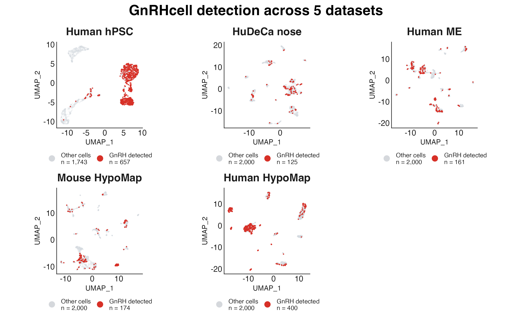

</div>

Detected cells occupy coherent transcriptional neighborhoods across the five
demo objects, while their distribution varies with biological context and source
study.

<div align="center">

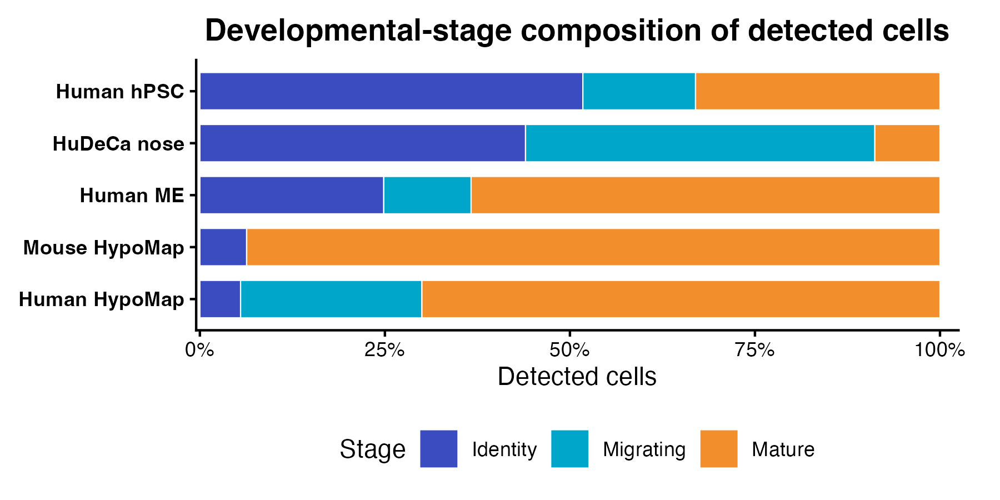

</div>

Stage composition separates identity-rich differentiation and fetal-nose
objects from the mature-cell-dominated hypothalamic references. The full table,
figure-building code, and interpretation notes are available in the
[demo results gallery](https://ymbouamboua.github.io/GnRHcell/articles/demo-results.html).

## Demo datasets and primary references

The repository includes five compact, preprocessed Seurat objects for examples,
testing, and method demonstration. These objects are **sampled derivatives** of
the source studies: their cell counts and cell-type proportions therefore differ
from the complete published datasets and should not be used to reproduce the
original study statistics.

| ID | Demo object | Cells | Source study |
|---|---|---:|---|
| `hpsc` | Human pluripotent stem cell-derived GnRH differentiation | 2,400 | [*Deciphering the Transcriptional Landscape of Human Pluripotent Stem Cell-Derived GnRH Neurons*](https://pmc.ncbi.nlm.nih.gov/articles/PMC9806769/) ([GEO: GSE212901](https://www.ncbi.nlm.nih.gov/geo/query/acc.cgi?acc=GSE212901)) |
| `hudeca_nose` | Human fetal nose, post-conception weeks 7--12 | 2,125 | [*A single-cell and spatial atlas of early human olfactory development*](https://doi.org/10.1038/s41467-026-71595-6) ([EGA: EGAD50000001712](https://ega-archive.org/datasets/EGAD50000001712)) |
| `human_me` | Human median eminence/hypothalamic samples from control, Alzheimer's disease, and frontotemporal dementia donors | 2,161 | Sauve et al. (2026), [*Tanycytic degeneration impairs tau clearance and contributes to Alzheimer's disease pathology*](https://doi.org/10.1016/j.cpblue.2026.100003) |
| `mouse_hypomap` | Integrated mouse hypothalamus atlas | 2,174 | Steuernagel, Lam, Klemm et al. (2022), [*HypoMap---a unified single-cell gene expression atlas of the murine hypothalamus*](https://doi.org/10.1038/s42255-022-00657-y) |
| `human_hypomap` | Human hypothalamus atlas | 2,400 | Tadross, Steuernagel, Dowsett et al. (2025), [*A comprehensive spatio-cellular map of the human hypothalamus*](https://doi.org/10.1038/s41586-024-08504-8) |

Please cite both **GnRHcell** and the corresponding primary study when using a
demo object. Consult the linked source repository or archive for the complete
dataset, original processing details, access conditions, and reuse terms.

Because these objects are stored as `.rds` files, load them with `readRDS()` rather than `data()`:

```{r load-reference-data}
load_gnrh_data <- function(name) {
  available <- c(
    "hpsc",
    "hudeca_nose",
    "human_me",
    "mouse_hypomap",
    "human_hypomap"
  )

  name <- match.arg(name, available)
  path <- system.file(
    "extdata",
    paste0(name, ".rds"),
    package = "GnRHcell"
  )

  if (!nzchar(path)) {
    stop("Dataset not found in the installed GnRHcell package: ", name)
  }

  readRDS(path)
}

hpsc <- load_gnrh_data("hpsc")
hpsc
```

```text
An object of class Seurat
33538 features across 2400 samples within 1 assay
Active assay: RNA (33538 features, 2000 variable features)
 3 layers present: data, counts, scale.data
 3 dimensional reductions calculated: pca, harmony, umap
```


Load all reference datasets when sufficient memory is available:

```{r load-all-reference-data}
dataset_ids <- c(
  "hpsc",
  "hudeca_nose",
  "human_me",
  "mouse_hypomap",
  "human_hypomap"
)

reference_objects <- setNames(
  lapply(dataset_ids, load_gnrh_data),
  dataset_ids
)
```

For memory-constrained analyses, load and process one object at a time.

## Visualization

### Embeddings

```{r embedding-status-stage, fig.width=8, fig.height=6}
plot_gnrh_embedding(
  hpsc,
  group_by = "gnrh_status",
  reduction = "umap",
  style = "classic"
)

plot_gnrh_embedding(
  hpsc,
  group_by = "gnrh_stage",
  reduction = "umap",
  percentage = TRUE,
  cols = gnrh_colors("stage")
)
```

Result from the bundled `hpsc` object:

<div align="center">

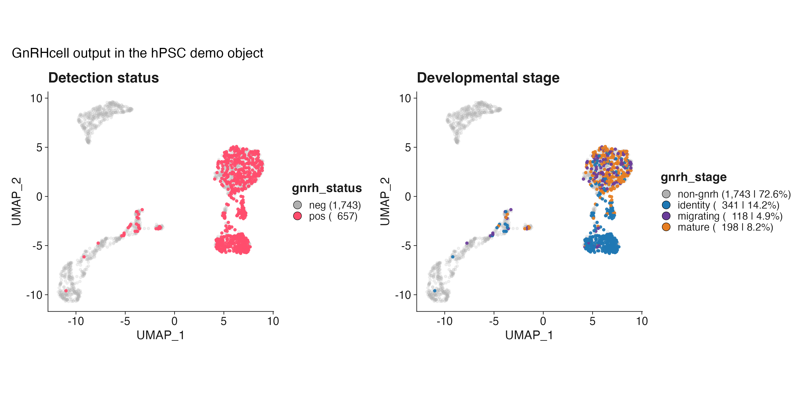

</div>

Large datasets are rasterized automatically when appropriate.

### Feature presets

`plot_gnrh_feature()` supports direct feature names and GnRHcell presets.

```{r feature-presets}
plot_gnrh_feature(
  hpsc,
  preset = "core",
  reduction = "umap",
  ncol = 4
)

plot_gnrh_feature(
  hpsc,
  preset = "modules",
  theme.cols = "viridis",
  reduction = "umap",
  ncol = 4
)

plot_gnrh_feature(
  hpsc,
  preset = "staging",
  theme.cols = "gnrh",
  reduction = "umap",
  ncol = 3
)
```

Core-feature result:

<div align="center">

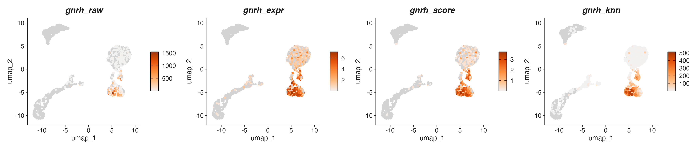

</div>

Plot arbitrary genes or metadata fields:

```{r custom-features}
plot_gnrh_feature(
  hpsc,
  features = c("GNRH1", "FEZF1", "ISL1", "DCX"),
  ncol = 4
)
```

<div align="center">

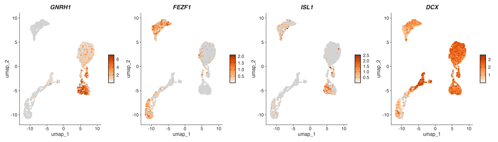

</div>


### Dot plots

```{r dot-plot, fig.width=9, fig.height=4}
plot_gnrh_dot(
  hpsc,
  features = c(
    "ISL1","SIX3","DLX1","DLX2","DLX5","DLX6","PBX3","RASD1","RMST", # identity
    "PROKR2","NSMF","SEMA3C","SEMA3F","ROBO2","ROBO3","RIPOR2","PLXNA3","SLIT1","CXCR4", # migrating
    "KISS1R","DOC2B","PTPRN","BAIAP3","ECEL1","SCG2","SCG5","NALCN" # mature
  ),
  group.by = "gnrh_stage",
  dot.outline = TRUE,
  th.cols = "RdYlBu"
)
```

Result:

<div align="center">

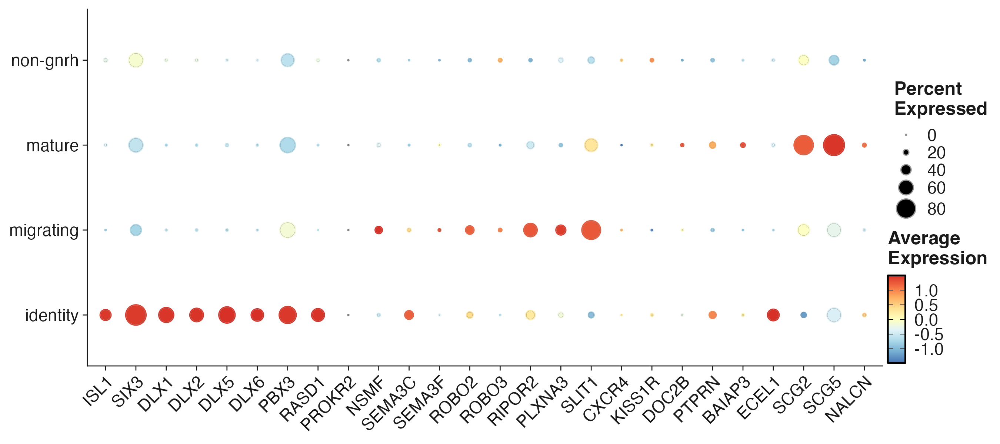

</div>

### Distributions

```{r distribution, fig.width=4, fig.height=4}
plot_gnrh_distribution(
  hpsc,
  group.by = "gnrh_stage",
  split.by = "orig.ident",
  proportion = TRUE,
  adaptive = FALSE,
  cols = gnrh_colors("stage"),
  bar.width = 0.3,
  bar.gap = 0.2,
  x.ang = 45,
  legend.position = "right"
)
```

Result:

<div align="center">

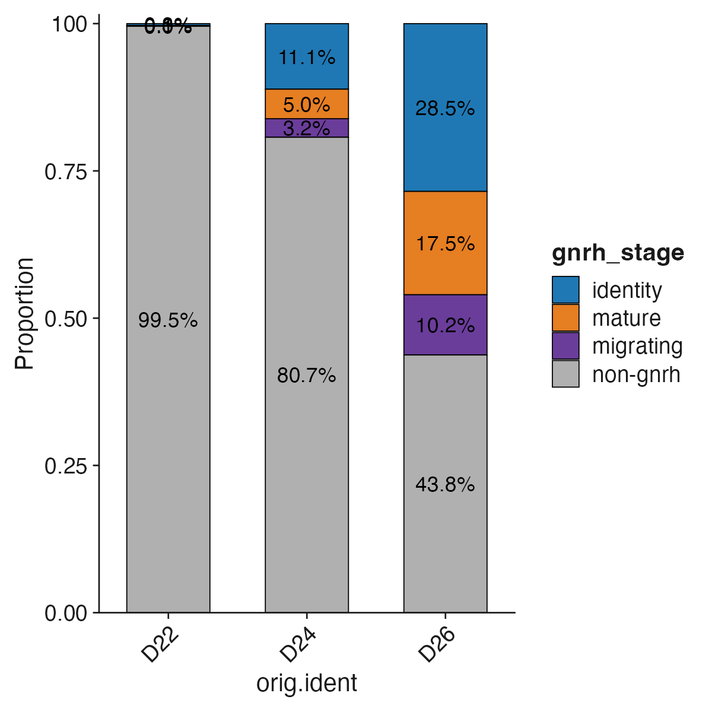

</div>

### Diagnostic report

```{r diagnostic-report,fig.width=14, fig.height=7.5}
hpsc <- run_gnrh(hpsc)

report <- gnrh_report(
  hpsc,
  roc_mode = "internal",
  style = "bw"
)

report
```

Compact internal diagnostic result:

<div align="center">

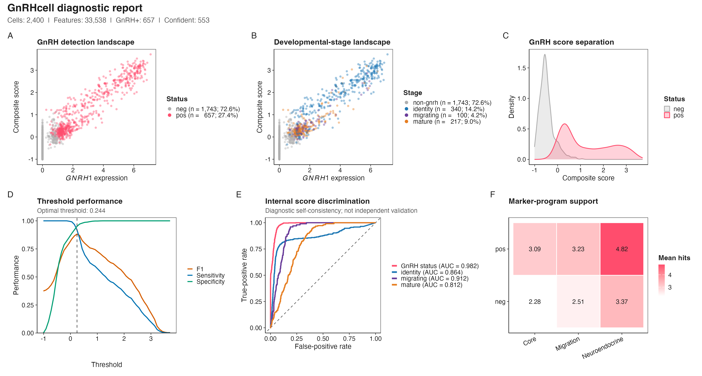

</div>

Internal ROC curves describe score discrimination against classifications produced by the same scoring system. They are diagnostic and should not be interpreted as independent validation.

When an independent manual or reference annotation is available:

```{r external-validation-report,fig.width=14, fig.height=7.5}
report <- gnrh_report(
  hpsc,
  truth = "gnrh_class",
  positive_truth = c("GnRH", "pos", "TRUE"),
  roc_mode = "external",
  style = "bw"
)
report
```

<div align="center">

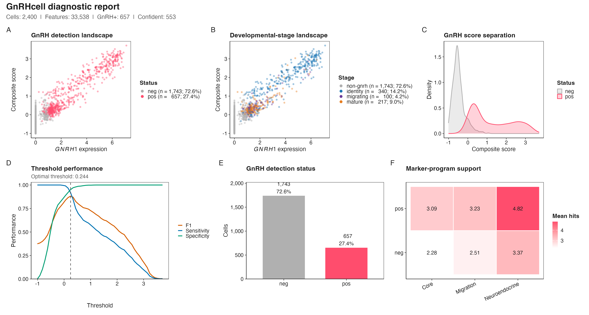

</div>

Export a vector report:

```{r export-report}
ggplot2::ggsave(
  "gnrh_diagnostic_report.pdf",
  report,
  width = 12,
  height = 7.5,
  units = "in",
  device = grDevices::cairo_pdf,
  bg = "white"
)
```

## GnRH-lineage marker discovery

`find_gnrh_genes()` identifies genes enriched in GnRH-positive cells relative to biologically matched controls and ranks them using differential expression, specificity, `GNRH1` co-detection, and donor recurrence.

```{r lineage-markers}
genes <- find_gnrh_genes(
  object = hpsc,
  annotation_col = "ann2",
  control_ident = "GLU",
  donor_col = "orig.ident",
  assay = "RNA",
  layer = "data"
)

head(genes$candidates, 20)
genes$donor_cells
```


```text
[GNRH] GnRH marker discovery
[STEP] Running DE method: wilcox
[DONE] Markers detected: 199 Duration: 2.8s
[INFO] Top marker: GNRH1
```

Top results from the `hpsc` comparison (`gnrh_status == "pos"` versus
`ann2 == "GLU"` controls):

| Gene | log2 fold change | Target detection | Control detection | Specificity | GNRH1 co-expression |
|---|---:|---:|---:|---:|---:|
| `DLX5` | 6.40 | 38.7% | 1.1% | 0.376 | 0.529 |
| `DLX1` | 6.90 | 33.6% | 0.5% | 0.331 | 0.486 |
| `ARX` | 7.25 | 31.2% | 0.4% | 0.308 | 0.499 |
| `DLX2` | 6.58 | 30.9% | 0.5% | 0.304 | 0.449 |
| `RASD1` | 6.85 | 27.9% | 0.5% | 0.273 | 0.442 |

The complete result is available in
[`hpsc-lineage-markers.csv`](https://github.com/ymbouamboua/GnRHcell/blob/main/man/figures/hpsc-lineage-markers.csv).

Choose `annotation_col` and `control_ident` according to the metadata and biology of the dataset. The control population should represent a relevant non-GnRH neuronal comparison rather than all cells indiscriminately.

### Co-expression and gene networks

```{r marker-visualization, fig.width=10, fig.height=5}
p1=plot_gnrh_coexpr(
  genes$markers,
  coexp_cutoff = 0.30
)

p2=plot_network(
  genes$markers,
  top_n = 40,
  threshold = 0.10
)
p1+p2
```

Result:

<div align="center">

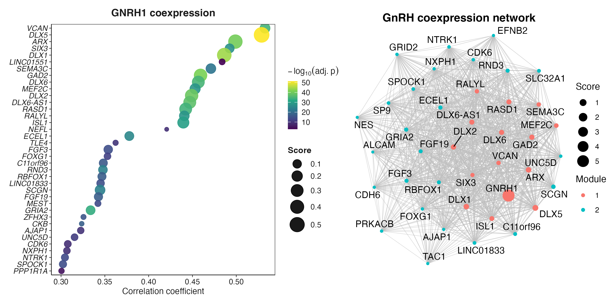

</div>

## Stage-specific marker discovery

`find_gnrh_stage_markers()` compares each selected developmental stage with the other GnRH-positive stages. It does not require coexpression with `GNRH1`, avoiding enrichment for general GnRH-lineage markers.

```{r stage-markers}
stage_markers <- find_gnrh_stage_markers(
  object = hpsc,
  stage_col = "gnrh_stage",
  stages = c("identity", "migrating", "mature"),
  class_col = "gnrh_class",
  positive_classes = c("direct", "supported"),
  donor_col = "orig.ident",
  assay = "RNA",
  layer = "data"
)

stage_markers$stage_counts
head(stage_markers$candidates, 20)
```

Top stage-associated results in the `hpsc` demo:

| Stage | Gene | log2 fold change | Detected in target | Detected in reference | Adjusted P |
|---|---|---:|---:|---:|---:|
| Identity | `DLX5` | 4.28 | 67.2% | 7.9% | 2.83e-51 |
| Identity | `DLX1` | 5.18 | 61.3% | 3.8% | 9.13e-50 |
| Identity | `SIX3` | 2.32 | 85.0% | 52.2% | 5.87e-45 |
| Migrating | `SLIT1` | 1.70 | 78.0% | 32.3% | 1.79e-21 |
| Migrating | `UBE2E3` | 0.54 | 97.5% | 97.0% | 9.69e-08 |
| Migrating | `TBR1` | 0.98 | 72.9% | 45.8% | 6.74e-06 |
| Mature | `SCG2` | 2.44 | 80.3% | 25.7% | 2.79e-40 |
| Mature | `EMX2` | 1.54 | 94.4% | 44.7% | 1.69e-35 |
| Mature | `LHX5-AS1` | 1.35 | 95.5% | 50.5% | 1.42e-29 |


```{r}
library(dplyr)
top <- stage_markers$candidates %>% 
  group_by(stage) %>% 
  top_n(n = 5, wt = avg_log2FC)

plot_gnrh_dot(
  hpsc,
  features = rev(top$gene),
  group.by = "gnrh_stage",
  dot.outline = TRUE,
  th.cols = "RdYlBu",
  title = "GnRH developmental programs"
)
```

<div align="center">

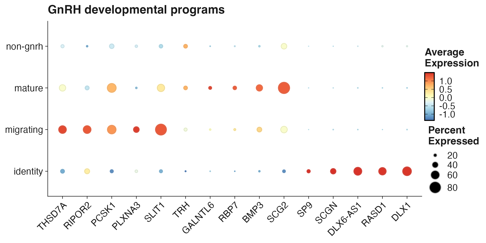

</div>

The complete result is available in
[`hpsc-stage-markers.csv`](https://github.com/ymbouamboua/GnRHcell/blob/main/man/figures/hpsc-stage-markers.csv).

Retrieve the top markers per stage:

```{r top-stage-markers}
top_stage_markers <- stage_markers$candidates |>
  dplyr::group_by(.data$stage) |>
  dplyr::slice_max(
    order_by = .data$stage_score,
    n = 20,
    with_ties = FALSE
  ) |>
  dplyr::ungroup()

top_stage_markers
```

Cell-level differential expression is intended for marker discovery. Replicate-aware pseudobulk testing is recommended before making formal population-level claims.

## Multi-dataset workflow

### Configure datasets

Each row defines an independent Seurat dataset:

```{r collection-configuration}
datasets <- data.frame(
  id = c(
    "hpsc",
    "hudeca_nose",
    "human_me",
    "mouse_hypomap",
    "human_hypomap"
  ),
  label = c(
    "Human hPSC",
    "HuDeCa nose",
    "Human ME",
    "Mouse HypoMap",
    "Human HypoMap"
  ),
  species = c(
    "Human",
    "Human",
    "Human",
    "Mouse",
    "Human"
  ),
  file = file.path(
    "inst/extdata",
    paste0(
      c(
        "hpsc",
        "hudeca_nose",
        "human_me",
        "mouse_hypomap",
        "human_hypomap"
      ),
      ".rds"
    )
  ),
  split_by = c(
    "orig.ident",
    "orig.ident",
    "orig.ident",
    "orig.ident",
    "orig.ident"
  ),
  reduction = c(
    "umap",
    "umap",
    "umap",
    "umap",
    "umap"
  )
)
```

For installed package data, replace the paths with calls to `system.file()`.

### Validate the configuration

```{r validate-configuration}
datasets <- prepare_gnrh_datasets(
  datasets,
  check_files = TRUE,
  remove_missing = FALSE
)

datasets
```

Validation result for the bundled configuration:

| ID | Species | File | Reduction | Status |
|---|---|---|---|---|
| `hpsc` | Human | `inst/extdata/hpsc.rds` | UMAP | Ready |
| `hudeca_nose` | Human | `inst/extdata/hudeca_nose.rds` | UMAP | Ready |
| `human_me` | Human | `inst/extdata/human_me.rds` | UMAP | Ready |
| `mouse_hypomap` | Mouse | `inst/extdata/mouse_hypomap.rds` | UMAP | Ready |
| `human_hypomap` | Human | `inst/extdata/human_hypomap.rds` | UMAP | Ready |

### Run the collection

```{r run-collection}
collection <- run_gnrh_collection(
  datasets = datasets,
  output_dir = "gnrh_results",
  run_markers = TRUE,
  run_comparisons = TRUE,
  run_programs = TRUE,
  clean_objects = FALSE,
  save_objects = FALSE
)


comparison <- collection$comparisons

comparison$runtime_plot
comparison$detected_plot
comparison$overlap
comparison$programs
comparison$gallery$umap_plot
comparison$gallery$stage_plot
```


### Collection gallery assets

`run_gnrh_collection()` now builds the cross-dataset gallery as part of its
comparison step. With `clean_objects = FALSE`, it uses the processed objects
kept in memory. With `save_objects = TRUE`, it can load them from the collection
output directory. The configured reduction is respected, including `umap_scvi`.

```{r collection-gallery}
collection$comparisons$gallery$summary
collection$comparisons$gallery$umap_plot
collection$comparisons$gallery$stage_plot
```


```{r inspect-collection}
names(collection$results)
names(collection$comparisons)

collection$comparisons$runtime_plot
collection$comparisons$detected_plot
collection$comparisons$programs$summary
```

The workflow loads datasets sequentially, runs GnRHcell, creates dataset-level outputs, compares markers, and optionally identifies conserved programs.

For lower memory use:

```{r memory-efficient-collection}
collection <- run_gnrh_collection(
  datasets = datasets,
  output_dir = "gnrh_results",
  clean_objects = TRUE,
  save_objects = TRUE
)
```

### Validate a collection

Processed objects must remain available in the collection when running validation directly:

```{r validate-collection}
validation <- validate_gnrh_collection(
  collection,
  positive_classes = c("direct", "supported"),
  assay = "RNA",
  layer = "data"
)
```

```text
==== GNRH COLLECTION VALIDATION START ====
Summarizing datasets
Validating GnRH detection
Summarizing GNRH1-negative transcriptomic candidates
Checking status/class consistency
Summarizing GnRH evidence scores
Validating developmental stages
Summarizing biological marker expression
Validated 5 datasets; 11,260 cells; 1,517 GnRH-positive cells.
GNRH1-negative transcriptomic candidates: 14 (diagnostic only; not counted as GnRH-positive).
Developmental-stage refinements: 66 cells.
Migration refinement: 66 / 372 raw migrating cells reassigned (17.74%).
==== GNRH COLLECTION VALIDATION DONE ====
```


```{r inspect-validation-results}
validation$detection
validation$status_class
validation$scores
validation$stages
validation$stage_class
validation$stage_refinement
validation$stage_reassignment
validation$migration_core
validation$biological_markers
```

Cross-dataset result:

| Dataset | Cells | GnRH detected | Identity | Migrating | Mature |
|---|---:|---:|---:|---:|---:|
| hPSC-derived GnRH | 2,400 | 657 | 341 | 118 | 198 |
| Human fetal nose | 2,125 | 125 | 57 | 58 | 10 |
| Human median eminence | 2,161 | 161 | 42 | 25 | 94 |
| Mouse HypoMap | 2,174 | 174 | 10 | 0 | 164 |
| Human HypoMap | 2,400 | 400 | 27 | 105 | 268 |

<div align="center">


</div>


<div align="center">

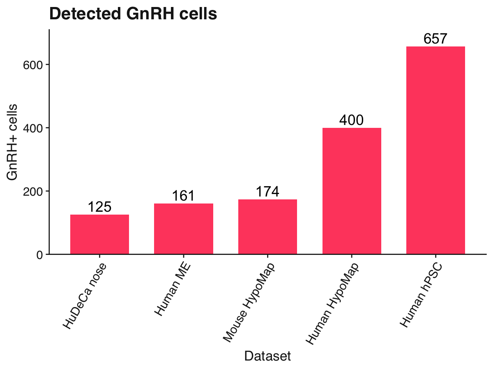

</div>

### Run one dataset

```{r run-one-dataset}
result <- run_gnrh_dataset(
  object = hpsc,
  dataset_id = "hpsc",
  dataset_label = "Human hPSC",
  split_by = "orig.ident",
  reduction = "umap",
  output_dir = "hpsc_gnrh_results",
  run_markers = TRUE,
  clean_object = FALSE
)

result$run_info
head(result$markers)
```

```text
Running GnRHcell: Human hPSC
[GNRH] ==== STARTING GnRHcell PIPELINE ====
[STEP] [1/3] Detecting GnRH cells
[INFO] Using assay: RNA
[INFO] Matrix loaded: 33538 genes by 2400 cells
[INFO] Using GnRH gene: GNRH1
[DONE] Detection complete. Duration: 0.4s
[STEP] [2/3] Assigning developmental stages
[DONE] Staging complete. Duration: 0.1s
[STEP] [3/3] Running diagnostics
[DONE] Diagnostics complete. Duration: 0.0s
[INFO] PIPELINE SUMMARY
[INFO] Status:
[INFO]   neg: 1743
[INFO]   pos: 657
[INFO] Stage:
[INFO]   identity: 341
[INFO]   migrating: 118
[INFO]   mature: 198
[INFO]   non-gnrh: 1743
[INFO] Secretory:
[INFO]   limited: 118
[INFO]   supported: 539
[INFO]   non-gnrh: 1743
[DONE] ==== GnRHcell PIPELINE COMPLETE ==== Duration: 0.6s
[INFO] Generating publication-ready GnRH QC report
[GNRH] GnRH marker discovery
[STEP] Running DE method: wilcox
[DONE] Markers detected: 105 Duration: 3.1s
[INFO] Top marker: GNRH1
```

## Cross-dataset comparisons

```{r compare-datasets}
comparison <- compare_gnrh_datasets(
  datasets = datasets,
  output_dir = "gnrh_results",
  run_programs = TRUE,
  run_gallery = TRUE,
  objects = lapply(collection$results, `[[`, "object")
)

comparison$runtime_plot
comparison$detected_plot
comparison$overlap
comparison$programs
comparison$gallery
comparison$gallery$summary
comparison$gallery$umap_plot
comparison$gallery$stage_plot
```


Marker programs can also be generated from existing result tables:

```{r marker-programs}
files <- c(
  "HuDeCa nose" = "gnrh_hudeca_nose_markers.tsv",
  "Human hPSC" = "gnrh_hpsc_markers.tsv",
  "Human medial eminence" = "gnrh_human_me_markers.tsv",
  "Human HypoMap" = "gnrh_human_hypomap_markers.tsv",
  "Mouse HypoMap" = "gnrh_mouse_hypomap_markers.tsv"
)

gene_sets <- build_gene_sets(
  files = files,
  dir = file.path("gnrh_results", "markers")
)

overlap <- gnrh_gene_upset(
  gene_sets = gene_sets,
  outdir = file.path("gnrh_results", "comparisons", "marker_overlap")
)
```


<div align="center">

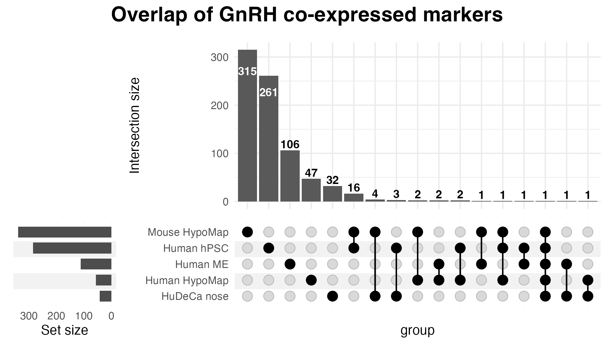

</div>

### Compare marker scores across datasets

`merge_gnrh_marker_scores()` converts the dataset-level outputs from
`gnrh_markers()` into a gene-by-dataset matrix. Gene symbols are standardized
to uppercase by default, and genes absent from a dataset remain `NA` so that
missing markers are not confused with genuine zero scores.

The plotting functions require the optional Bioconductor packages
`ComplexHeatmap` and `circlize`:

```{r install-marker-heatmap-dependencies}
# install.packages("BiocManager")
# BiocManager::install(c("ComplexHeatmap", "circlize"))
```

Use the marker files produced by `run_gnrh_collection()`:

```{r merge-cross-dataset-marker-scores}
marker_dir <- file.path("gnrh_results", "markers")

marker_files <- stats::setNames(
  paste0("gnrh_", datasets$id, "_markers.tsv"),
  datasets$label
)

marker_files <- marker_files[
  file.exists(file.path(marker_dir, marker_files))
]

stopifnot(length(marker_files) >= 2L)

marker_matrix <- merge_gnrh_marker_scores(
  marker_files,
  dir = marker_dir
)

marker_matrix[seq_len(min(10L, nrow(marker_matrix))), , drop = FALSE]
attr(marker_matrix, "score_columns")
```

When `score_col = NULL`, each table uses the first available column among
`score`, `avg_log2FC`, `coexpr`, and `avg_logFC`. For directly comparable
heatmaps, specify the same score explicitly when it is present in every table:

```{r conserved-gnrh-marker-heatmap, fig.width=4, fig.height=3}
conserved_markers <- plot_gnrh_conserved_markers(
  files = marker_files,
  dir = marker_dir,
  score_col = "avg_log2FC",
  min_datasets = 3,
  top_n = 50,
  scale_rows = F,
  cluster_rows = TRUE,
  cluster_columns = FALSE,
  filename = file.path(
    "gnrh_results",
    "comparisons",
    "conserved_gnrh_markers.pdf"
  )
)

conserved_markers$conserved
conserved_markers$heatmap


conserved_markers <- plot_gnrh_conserved_markers(
  files = marker_files,
  dir = marker_dir,
  score_col = "avg_log2FC",
  min_datasets = 3,
  top_n = 50,
  scale_rows = FALSE,
  cluster_rows = FALSE,
  cluster_columns = FALSE,
  filename = file.path(
    "gnrh_results",
    "comparisons",
    "conserved_gnrh_markers.pdf"
  )
)

conserved_markers$heatmap
```

<div align="center">

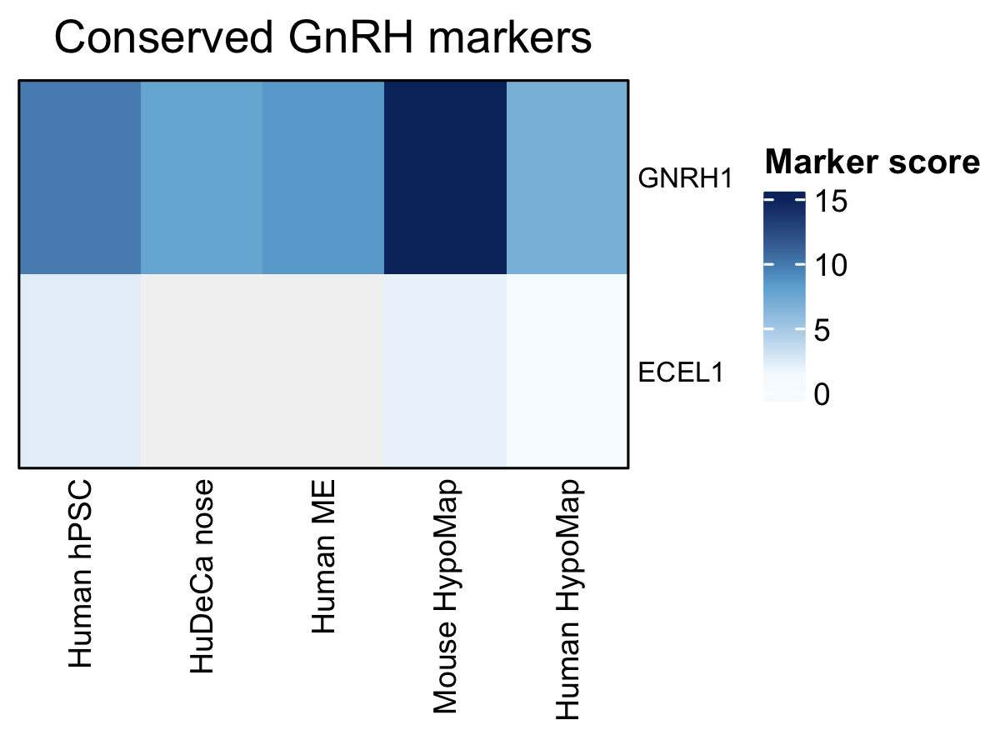

</div>


Conserved markers are ranked first by the number of supporting datasets and
then by their mean marker score. Dataset-specific markers are restricted by
their cross-dataset support and ranked by the difference between their target
dataset score and the mean score in the other datasets:

```{r dataset-specific-gnrh-marker-heatmap}
specific_markers <- plot_gnrh_dataset_specific_markers(
  files = marker_files,
  dir = marker_dir,
  score_col = "avg_log2FC",
  top_n_per_dataset = 20,
  max_datasets = 2,
  scale_rows = F,
  cluster_rows = FALSE,
  cluster_columns = FALSE,
  filename = file.path(
    "gnrh_results",
    "comparisons",
    "dataset_specific_gnrh_markers.pdf"
  )
)

specific_markers$specific_table
specific_markers$heatmap
```

<div align="center">

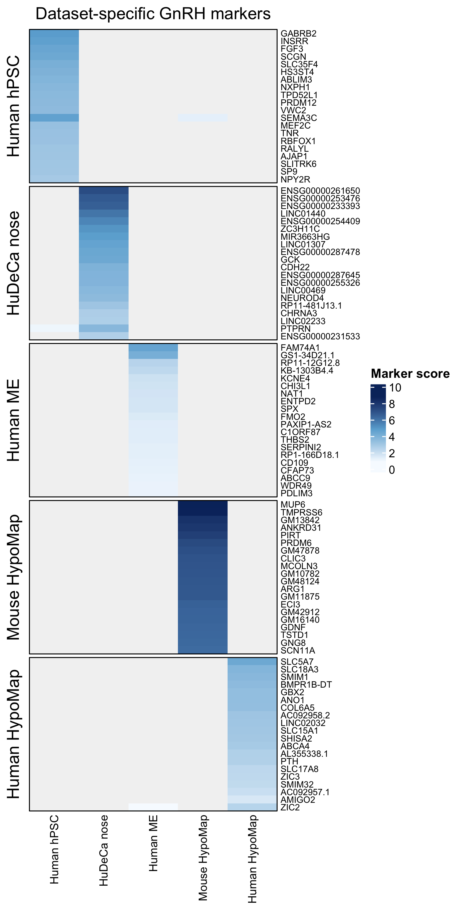

</div>


The returned tables can be filtered or exported independently of the
heatmaps:

```{r export-cross-dataset-marker-tables}
utils::write.csv(
  conserved_markers$conserved,
  file.path("gnrh_results", "comparisons", "conserved_gnrh_markers.csv"),
  row.names = FALSE
)

utils::write.csv(
  specific_markers$specific_table,
  file.path("gnrh_results", "comparisons", "dataset_specific_gnrh_markers.csv"),
  row.names = FALSE
)
```

These score-based heatmaps complement `gnrh_gene_upset()`: the UpSet plot
describes set membership, whereas the heatmaps retain marker-effect magnitude
across datasets.


```{r classify-marker-programs}
marker_dir <- file.path("gnrh_results", "markers")

files <- c(
  "Human hPSC" = "gnrh_hpsc_markers.tsv",
  "HuDeCa nose" = "gnrh_hudeca_nose_markers.tsv",
  "Human medial eminence" = "gnrh_human_me_markers.tsv",
  "Human HypoMap" = "gnrh_human_hypomap_markers.tsv",
  "Mouse HypoMap" = "gnrh_mouse_hypomap_markers.tsv"
)

files <- stats::setNames(
  file.path(marker_dir, unname(files)),
  names(files)
)

stopifnot(all(file.exists(files)))
files

programs <- gnrh_marker_programs(
  files = files,
  results = overlap,
  outdir = "gnrh_results"
)
```


Visualize the results:

```{r marker-program-plots}
plot_gnrh_marker_programs(
  programs,
  table = "high_confidence",
  type = "bar"
)
```

<div align="center">

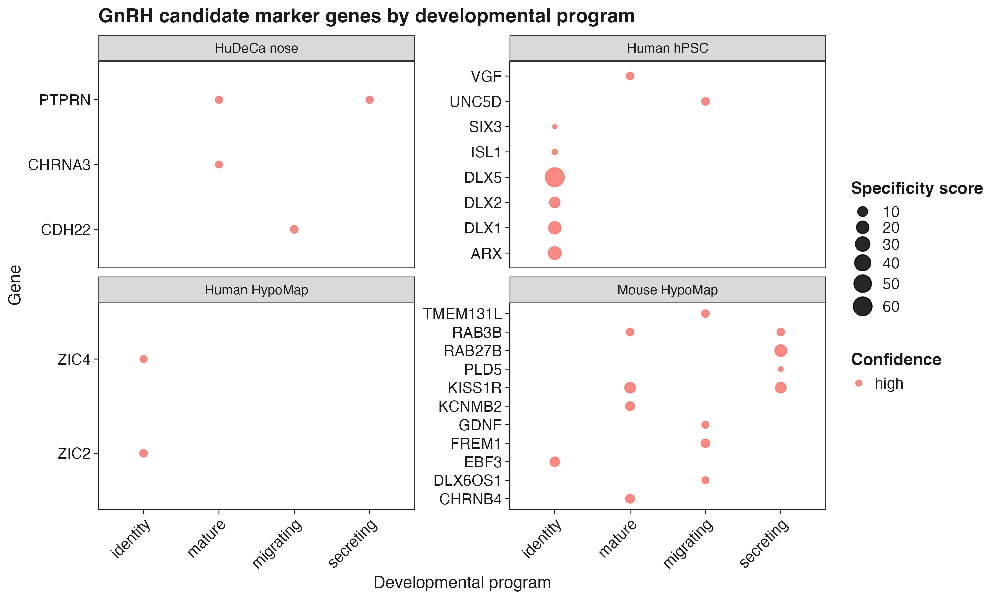

</div>


## Main functions

### Detection, staging, and diagnostics

- `run_gnrh()`
- `detect_gnrh()`
- `stage_gnrh()`
- `gnrh_diagnostics()`
- `gnrh_report()`

### Marker discovery

- `gnrh_markers()`
- `find_gnrh_genes()`
- `find_gnrh_stage_markers()`
- `build_gene_sets()`
- `gnrh_gene_upset()`
- `gnrh_marker_programs()`

### Visualization

- `plot_gnrh_embedding()`
- `plot_gnrh_feature()`
- `plot_gnrh_dot()`
- `plot_gnrh_distribution()`
- `plot_gnrh_hits()`
- `plot_gnrh_coexpr()`
- `plot_gnrh_specificity()`
- `plot_class_counts()`
- `plot_network()`
- `plot_gnrh_marker_programs()`
- `plot_gnrh_runtime_curve()`
- `plot_gnrh_detected()`

### Dataset collections

- `prepare_gnrh_datasets()`
- `run_gnrh_dataset()`
- `run_gnrh_collection()`
- `compare_gnrh_datasets()`
- `validate_gnrh_collection()`

### Palettes and reference modules

- `gnrh_colors()`
- `gnrh_stage_modules()`
- `gnrh_stage_gene_references()`

See the [function reference](https://ymbouamboua.github.io/GnRHcell/reference/) for the complete API.

## Typical output structure

```text
gnrh_results/
├── figures/
├── tables/
├── markers/
├── comparisons/
│   ├── marker_overlap/
│   ├── marker_programs/
│   └── gallery/
│       ├── collection-results.csv
│       ├── collection-umap-status.png
│       └── collection-stage-composition.png
├── validation/
└── objects/
```

Objects are written to `objects/` only when `save_objects = TRUE`.

## Reproducibility and interpretation

- Join split Seurat v5 assay layers with `Seurat::JoinLayers()` when required before marker analysis.
- Use biological donors or samples as replicates for formal differential-expression inference.
- Treat internal ROC curves as score-separation diagnostics, not external validation.
- Confirm stage-specific candidates in independent datasets or with pseudobulk analyses.
- Report the GnRHcell version and principal thresholds used in an analysis.

## Development

```{r development}
devtools::document()
devtools::test()
devtools::check()
pkgdown::build_site()
```

Rebuild `README.md` after editing this source file:

```{r rebuild-readme}
devtools::build_readme()
```

## Citation

If you use `GnRHcell`, please cite:

> Mbouamboua Y. *GnRHcell: detection, developmental staging, and marker discovery for gonadotropin-releasing hormone neurons from single-cell RNA-seq data.*

## License

`GnRHcell` is available under the [MIT License](LICENSE).

## Development status

`GnRHcell` is under active development. Interfaces and biological models may evolve as detection, staging, and cross-dataset validation methods are refined.
